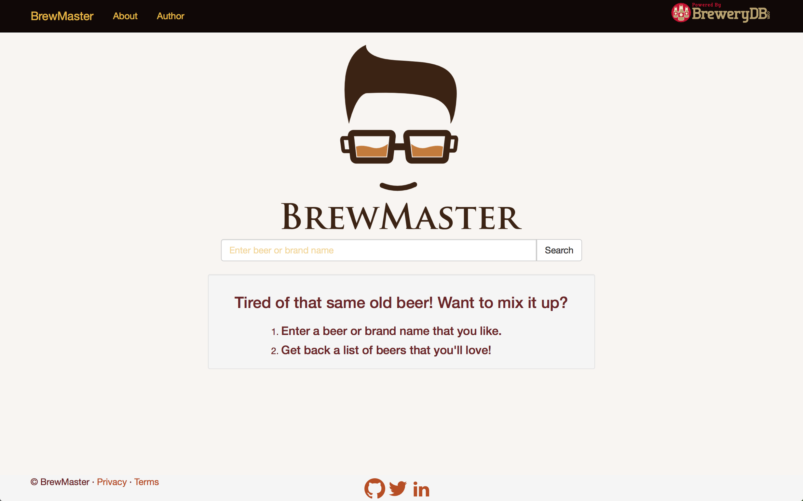

# BrewMaster

[BrewMaster]() is a web application that takes a beer name or brand as input and using a very simple 
algorithm outputs a list of similar beers.

<hr>



BrewMaster is an example Flask application created with [InsightFL](https://github.com/stormpython/insightfl), 
a basic Flask template. Interested in learning how this app was created? Check out the [blog]() post. Or if you're 
simply interested in the source code, follow the instructions below to fork the project.

#### System Requirements <a name="system-requirements"></a>
1. [Python](https://www.python.org/downloads/)(v2.7+) with [pip](http://pip.readthedocs.org/en/latest/installing.html) installed.

#### Setup <a name="environment-setup"></a>
1. [Fork](https://github.com/stormpython/brewmaster/fork) the project and clone the repository.

  ```
  git clone git@github.com:<username>/<project>.git
  ```

2. **Recommended:** Install virtualenv and fire up a virtual environment.

  ```
  # cd into your InsightFL project folder
  # Install virtualenv
  sudo pip install virtualenv

  # Create virtualenv folder `venv`
  virtualenv venv

  # Activate the virtual environment
  source venv/bin/activate
  ```

3. Install Python project dependencies.

  ```
  pip install -r requirements.txt
  ```

4. To test your application, run the manage.py file: `python manage.py runserver`, and open your web browser to
`localhost:5000`.